# Criando uma Rede Social - Should I Watch? 

## 1. Prefácio

"Should I Watch?" é uma rede social voltada principalmente ao público jovem e que tem como objetivo ajudá-los a escolher o que assistir entre as milhares de opções dos catálogos dos serviços de streaming. A ideia é que o usuário compartilhe, por meio de posts curtos e diretos, quais foram suas impressões sobre os últimos filmes e séries assistidos. 

&nbsp;
## 2. Pesquisa de Usuário

Para a validação da ideia dessa rede social, foi feita uma pesquisa com 60 potenciais usuários de idades diversas por meio de um formulário. Além disso, entrevistamos três usuários diretamente para entender melhor suas expectativas de uma rede social com esse tema. 

A pesquisa validou que a nossa ideia inicial tinha potencial porque mais de 80% dos entrevistados não sabem sempre o que querem assistir antes de ligar a TV/computador, mais de 70% passam muito tempo para decidir o que assistir e têm interesse em saber o que os seus conhecidos estão assistindo e todas as 60 pessoas responderam que gostam quando tem uma indicação de alguém sobre o que assistir. A pesquisa também apontou que aproximadamente 75% da amostragem tem o costume de assistir séries no dia-a-dia e quase um terço assiste séries e filmes todos os dias da semana. 

Você sempre sabe o que quer assistir antes de ligar a TV, o computador etc.?|Você passa muito tempo para decidir o que quer assistir?
:----------------------------------------:|:------------------------------------------:
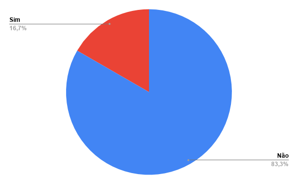|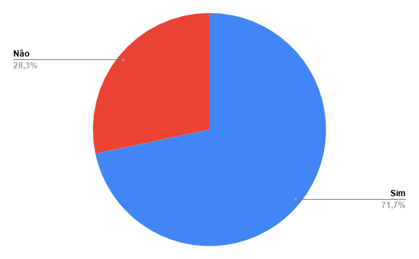

Você tem o costume de assistir séries e filmes no dia-a-dia?|Quantas vezes por semana você assiste séries e filmes?
:----------------------------------------:|:------------------------------------------:
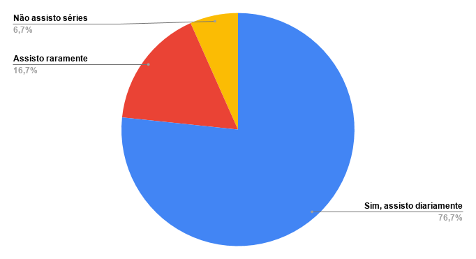|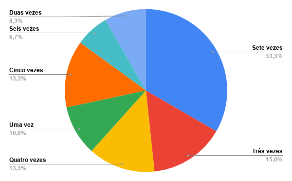

 Você tem interesse em saber o que seus conhecidos estão assistindo?  |Você tem dificuldades em decidir se vale a pena assistir algo só lendo a sinopse?
:----------------------------------------:|:------------------------------------------:
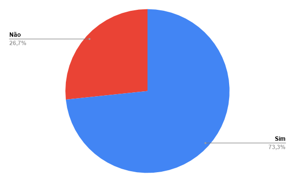|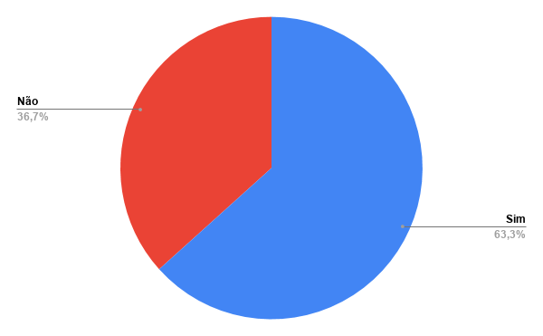

Você teria interesse em uma rede social focada em saber o que seus conhecidos acharam sobre um filme ou série? | Você consultaria uma rede social para descobrir o que seus conhecidos (ou outras pessoas) acharam de um filme antes de assisti-lo?
:----------------------------------------:|:------------------------------------------:
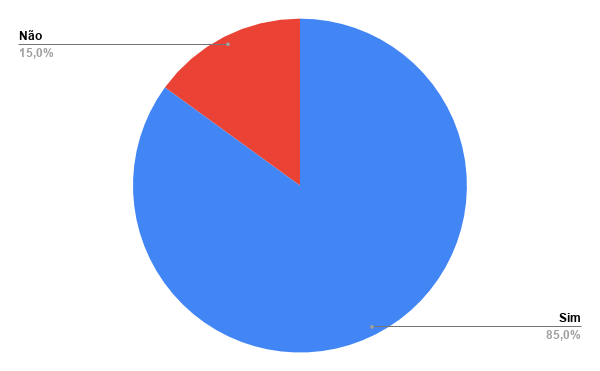|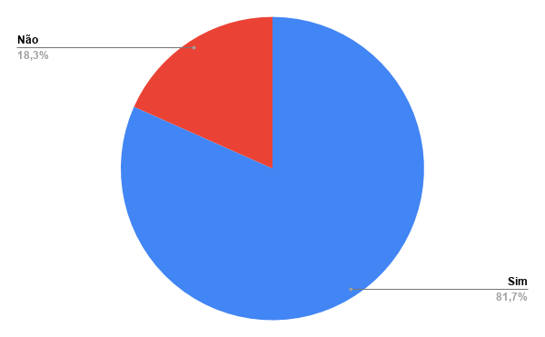

&nbsp;
## 3. Personas

Após a pesquisa (formulário e entrevistas), conseguimos formular uma protopersona, que seria nosso usuário ideal, e mais três personas, sendo uma delas um usuário potencial e duas delas usuários casuais: 

### **Usuário ideal: Antônio**

**Informações Demográficas**
-  25 anos
- Publicitário
- Solteiro
- Vive sozinho

**Comportamentos**
- Viciado em redes sociais
- Caseiro
- Passa a maior parte do seu tempo em casa no celular ou vendo televisão
- Ama conhecer novas culturas
- Assina várias plataformas de streaming

**Necessidades e Objetivos**
- Um lugar onde ele organize e avalie as últimas séries e filmes vistos
-  Conhecer novos conteúdos das plataformas que assina sem ser as recomendações da própria plataforma
- Menos tempo decidindo o que assistir e mais tempo assistindo
- Conhecer melhor os amigos, mas sem interações desnecessárias em uma nova rede social
- Conhecer novas culturas a partir das suas experiências cinematográficas

&nbsp;
### **Usuário potencial: Rafaella**

**Informações Demográficas**
- 16 anos
- Estudante
- Mora com os pais
- Fala bem inglês

**Comportamentos**
- Gosta de redes sociais nas quais ela possa decidir os temas da sua linha do tempo (por exemplo: Pinterest)
- Passa bastante tempo no seu quarto
- Vê filmes e séries todos os dias, mas sempre demora para decidir o que assistir 
- Gosta de assistir filmes e séries na língua inglesa para estudar

**Necessidades e objetivos**
- Acessar uma plataforma simples e direta, na qual ela passe menos tempo que antes para decidir o que assistir
- Interagir com os amigos a partir de suas avaliações
- Avaliar as séries que está assistindo por temporada e/ou episódios para acompanhar quais episódios que parou

&nbsp;
### **Usuário casual: Bruno**

**Informações Demográficas**
- 29 anos
- Engenheiro de Software
- Casado
- Geek

**Comportamentos**
- Utiliza pouco redes sociais
- Joga todos os dias (computador e/ou jogos de tabuleiros)
- Assiste mais animações e animes 
- Gosta de receber recomendações do que assistir de pessoas específicas

**Necessidades e Objetivos**
- Ver quais são as avaliações de certa série ou filme específicos
- Relembrar o que as pessoas acharam dos episódios anteriores das séries que assiste
- Acessar uma interface limpa e direta ao ponto 

&nbsp;
### **Usuário casual: Marcia**

**Informações Demográficas**
- 60 anos
- Casada
- Filhos adultos
- Trabalha em casa

**Comportamentos**
- Passa muito tempo vendo filmes e séries enquanto trabalha
- Ama viajar e conhecer novas culturas
- Aproxima-se dos filhos que moram em outros países por meio das redes sociais
- Sempre aceita as recomendações da própria plataforma de streaming porque não gosta de passar muito tempo decidindo o que ver

**Necessidades e Objetivos**
- Acompanhar o que os filhos e sobrinhos estão assistindo para conversar com eles depois
- Acompanhar recomendações de filmes e séries diferentes do que o que mostra a plataforma de streaming
- Acessar uma plataforma simples por não entender muito de tecnologia
- Saber em qual plataforma um filme ou série específica que ela queria ver lançou

&nbsp;
## 4. Histórias de Usuário

A partir das personas e dos critérios de aceitação minímos do projeto proposto pela Laboratória, elaboramos cinco histórias de usuário:

### História 1: Criar Conta
Eu, como usuária do site "Should I Watch?", gostaria de poder criar uma conta e caso eu preencha algum dado incorreto gostaria que o site sinalizasse o meu erro. A fim de poder acessar o conteúdo da rede social e criar meus conteúdos.

**Critérios mínimos de aceitação**
* [ ] Input para inserir o nome
* [ ] Input para inserir um username
* [ ] Input para inserir email
* [ ] Input para inserir a senha
* [ ] Input para confirmar a senha

**Definição de pronto**
* [ ] Conseguir criar uma conta
* [ ] Somente usuários com contas válidas têm acesso permitido
* [ ] Não haver usuários repetidos
* [ ] A conta do usuário deve ser um email válido
* [ ] Quando o formulário de registro é enviado, ele deve ser validado
* [ ] Se houver erros, mensagens descritivas devem ser exibidas para ajudar o usuário
* [ ] Ser uma SPA.
* [ ] Ser responsivo.
* [ ] Receber code review de pelo menos uma parceira de sua equipe.
* [ ] Fazer tests unitários.
* [ ] Fazer testes manuais buscando erros e imperfeições simples.
* [ ] Fazer testes de usabilidade e incorporar o feedback dos usuários como melhorias.

&nbsp;
### História 2: Autenticar Conta
Eu, como usuário do site "Should I Watch?", gostaria de poder logar no site com o meu e-mail e senha, anteriormente criado, ou logar através da minha conta google. E caso eu preencha algum dado incorreto gostaria que o site sinalizasse o erro. A fim de poder acessar minha conta.

**Critérios Mínimos de Aceitação**
* [ ] Input para Email
* [ ] Input para Senha
* [ ] Botão de Login
* [ ] Botão para Logar com Conta Google
* [ ] Botão de sign in que direciona para "tela de sign in"

**Definição de Pronto**
* [ ] Efetuar login com um email e senha cadastrados
* [ ] Efetuar login com o Google
* [ ] Login com Firebase (pode usar Firebase Authentication e Cloud Firestore)
* [ ] O que o usuário digita no campo de senha (input) deve ser secreto
* [ ] Quando o formulário de login é enviado, ele deve ser validado
* [ ] Se houver erros, mensagens descritivas devem ser exibidas para ajudar o usuário
* [ ] Ser uma SPA.
* [ ] Ser responsivo.
* [ ] Receber code review de pelo menos uma parceira de sua equipe.
* [ ] Fazer tests unitários.
* [ ] Fazer testes manuais buscando erros e imperfeições simples.
* [ ] Fazer testes de usabilidade e incorporar o feedback dos usuários como melhoria.

&nbsp;
### História 3: Criar Postagens 
Eu, como usuário do site "Should I Watch?", gostaria de criar postagens sobre os filmes ou séries que assisti, com as seguintes informações: Título, Resenha, Plataforma de Streaming Utilizada e Nota de Avaliação. A fim de compartilhar com o minha rede de conhecidos indicações ou contra-indicações sobre filmes e séries.

**Critérios Mínimos de Aceitação**
* [ ] Input para adicionar o título;
* [ ] Input para escrever a resenha;
* [ ] Input para informar a plataforma de streaming;
* [ ] Input para atribuir a nota de avaliação;
* [ ] Botão para cancelar a publicação;
* [ ] Botão para publicar;
* [ ] Printar a publicação na linha do tempo;

**Definição de Pronto**
* [ ] Conseguir publicar um post;
* [ ] Solicitar confirmação de cancelamento da publicação;
* [ ] Ao publicar, deve ser validado se há conteúdo no input;
* [ ] Ser uma SPA.
* [ ] Ser responsivo.
* [ ] Receber code review de pelo menos uma parceira de sua equipe.
* [ ] Fazer tests unitários.
* [ ] Fazer testes manuais buscando erros e imperfeições simples.
* [ ] Fazer testes de usabilidade e incorporar o feedback dos usuários como melhorias

&nbsp;
### História 4: Editar Postagens 
Eu, como usuário do site "Should I Watch?", gostaria de editar minhas postagens sobre os filmes ou séries que assisti. A fim de alterar alguma informação que adicionei erroneamente.

**Critérios Mínimos de Aceitação**
* [ ] Botão com opção de editar/excluir a postagem;
* [ ] Ao clicar em editar, alterar o texto para um input que permite editar o texto e salvar as alterações;
* [ ] Botão para salvar alterações;
* [ ] Botão para cancelar alterações;
* [ ] Ao salvar as alterações, voltar ao texto normal, mas com a informação editada;
* [ ] Ao recarregar a página, poder ver os textos editados.

**Definição de Pronto**
* [ ] Conseguir editar/excluir um post;
* [ ] Solicitar confirmação antes de excluir um post;
* [ ] Ser uma SPA.
* [ ] Ser responsivo.
* [ ] Receber code review de pelo menos uma parceira de sua equipe.
* [ ] Fazer tests unitários.
* [ ] Fazer testes manuais buscando erros e imperfeições simples.
* [ ] Fazer testes de usabilidade e incorporar o feedback dos usuários como melhorias.

&nbsp;
### História 5 - Visualizar e Interagir com Postagens
Eu, como usuária do site "Should I Watch?", gostaria de visualizar as postagens dos outros usuários e poder interagir com as mesmas, dar agree ou desagree, e poder visualizar a quantidade de cada interação. A fim de compartilhar a minha opinião sobre as postagens de títulos que eu já assisti e/ou me certificar se realmente a postagem de determinado usuário está de acordo com a maioria.

**Critérios Mínimos de Aceitação**
* [ ] Visualizar as postagens dos demais usuários;
* [ ] Botão para dar like;
* [ ] Botão para dar unlike;
* [ ] Contar a quantidade de likes;
* [ ] Contar a quantidade de unlikes.

**Definição de Pronto**
* [ ] Ao recarregar o aplicativo, é necessário verificar se o usuário está logado antes de exibir o conteúdo
* [ ] Visualizar as postagens dos outros usuários;
* [ ] Poder dar like ou unlike;
* [ ] Máximo de um like ou unlike por usuário;
* [ ] Visualizar contagem de likes e unlikes;
* [ ] Poder remover o like ou unlike;
* [ ] Ser uma SPA.
* [ ] Ser responsivo.
* [ ] Receber code review de pelo menos uma parceira de sua equipe.
* [ ] Fazer tests unitários.
* [ ] Fazer testes manuais buscando erros e imperfeições simples.
* [ ] Fazer testes de usabilidade e incorporar o feedback dos usuários como melhorias

&nbsp;
## 5. Protótipo 

A pesquisa também ajudou a entender como poderíamos desenhar a rede social: 
- Os entrevistados responderam que gostariam de saber em qual plataforma a outra pessoa assistiu certo filme ou série, assim criamos um input que obriga o usuário da rede social dizer onde assistiu o conteúdo; 
- Foi-lhes perguntado como eles gostariam de avaliar um filme ou série e a resposta ganhadora foi "Estrelas", assim, criamos um input em que o usuário pode escolher entre 0 e 5 estrelas para avaliação;
- Por último perguntamos se eles gostariam de ler comentários mais curtos ou textos mais complexos sobre os filmes ou séries e mais de 80% respondeu que preferia comentários curtos, assim, limitamos o input de comentário para até 400 caracteres.

Assim, desenhamos um protótipo das páginas:
Página Login|Página Registro|Página Criar Perfil|Página Timeline
:----------------------------------------:|:------------------------------------------:|:------------------------------------------:|:------------------------------------------:
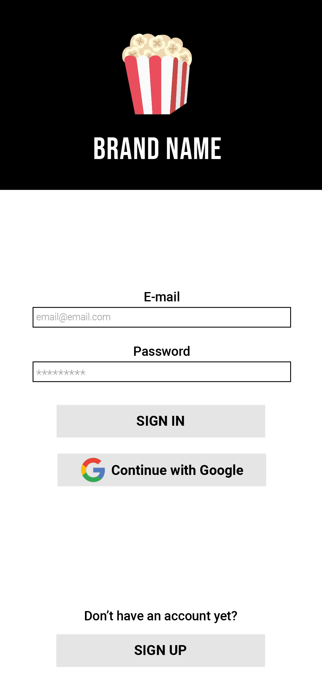|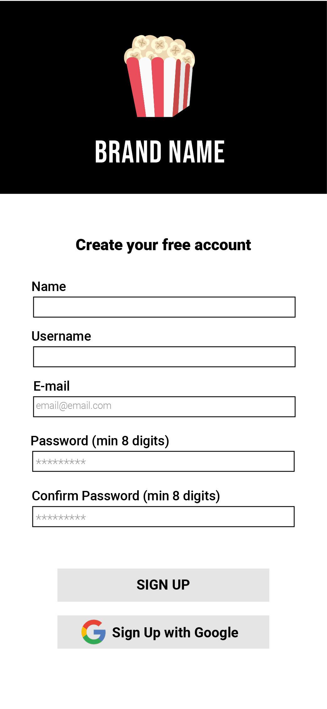|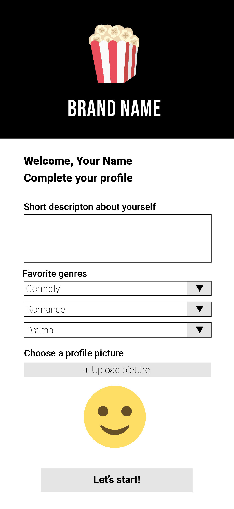|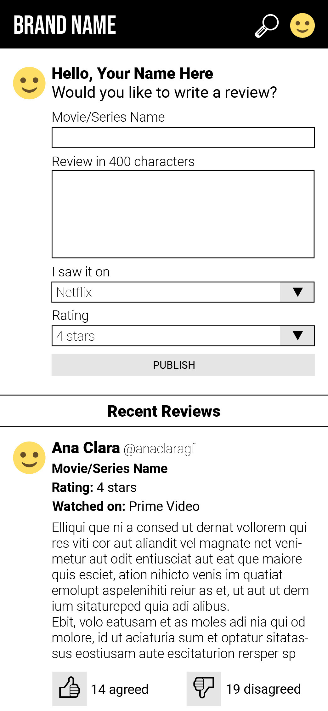

&nbsp;
## 6. Funcionalidades

A rede social "Should I Watch?" inicia na página de Sign In, como mostrado na imagem abaixo. O usuário tem duas opções de login: e-mail e senha ou conta do Google. Quando autenticado, o usuário é redirecionado diretamente para a timeline. Caso o usuário ainda não tenha uma conta, há o botão Sign Up que o redireciona para a página de registro. 

A página Register tem dois inputs para o usuário cadastrar um e-mail e senha e um terceiro input para confirmar a senha. O input de senha mostra um erro no momento da digitação até que sua senha tenha os seis caracteres mínimos. Da mesma maneira, o input de confirmar senha mostra um erro também no momento da digitação para avisar o usuário que a senha não é a mesma que colocada no input anterior. Assim que o usuário clica no botão Sign Up, ele é redirecionado para a página de Profile para criar seu perfil. Caso o usuário já seja cadastrado e tenha entrado nessa página por engano, há um botão no fim da página para voltar para a página de Sign In. 

A página Profile apresenta quatro inputs para o usuário informar seu nome completo, o nome de usuário desejado, uma pequena biografia e seus gêneros de filmes e séries favoritos. O input relacionado ao nome de usuário tem uma validação para nomes de usuários já existentes e a página não deixa o usuário completar seu perfil sem um nome de usuário original. Quando todos os campos estão preenchidos corretamente e o botão Create Profile é acionado, o usuário é redirecionado direto para a Timeline. 

A página Timeline apresenta todos os reviews já publicados na rede social. Logo ao lado da mensagem "Hello", há o botão de Sign Out, para o usuário se desconectar. Abaixo da mensagem de Hello, há um botão escrito "Would you like to write a review?" que, quando clicado, abre os inputs destinados à publicação de reviews. Caso o usuário desista de publicar, ele pode clicar no botão Close ou no botão Cancel. Para publicar, todos os inputs devem estar preenchidos corretamente e o usuário deve clicar no botão "Publish". Ao clicar no botão "Publish" os inputs destinados à publicação voltam a ficar escondidos e a nova publicação aparece na timeline. 

Para os posts publicados por outras pessoas, o usuário pode interagir de três maneiras: curtir, não-curtir ou commentar. Caso o usuário já tenha curtido uma publicação, ele pode cancelar a ação clicando de novo no botão. Caso ele queira trocar o curtir pelo não-curtir ou vice-versa é só clicar no outro botão. Para comentar, o usuário dele clicar no botão Comment, escrever algo no input e então clicar no botão Send. Caso ele deseje, ele pode exluir quaisquer comentários feitos por ele mesmo clicando na lixeira ao lado do comentário.

Para os posts publicado pelo próprio usuário, além das ações descritas acima, ele também pode editar o post e excluir os posts. Os botões relacionados à essas ações ficam ao lado do nome do filme ou série. Para editar um post, o usuário deve clicar no botão Edit e o post vai ser substituído por inputs de edição, ao terminar as modificações, ele deve clicar em update. Para cancelar a edição, ele deve clicar no botão Close acima dos inputs. Para excluir um post, o usuário deve clicar no botão Delete e então confirmar a exclusão na janela Confirm. 
